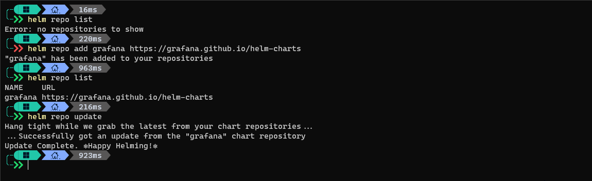
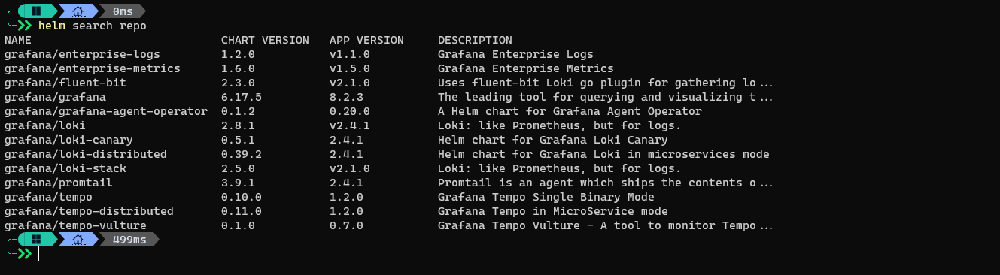
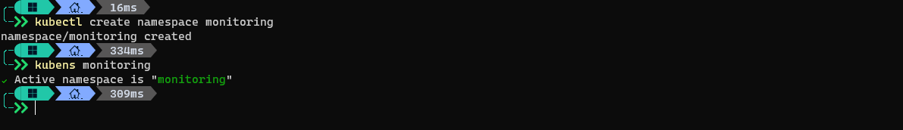
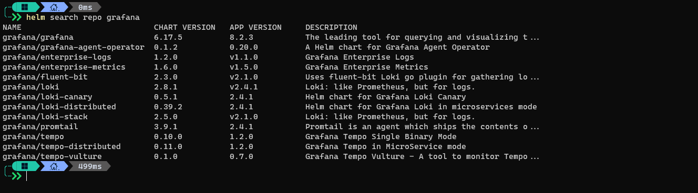
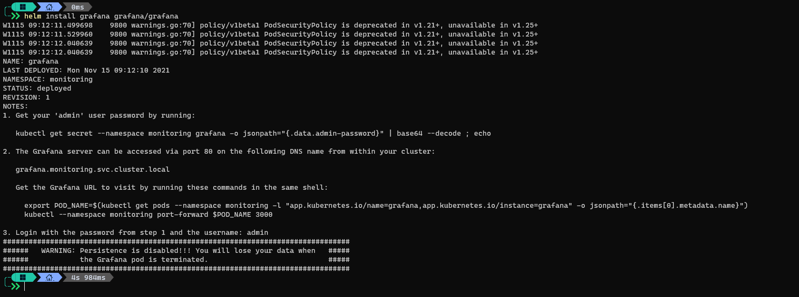
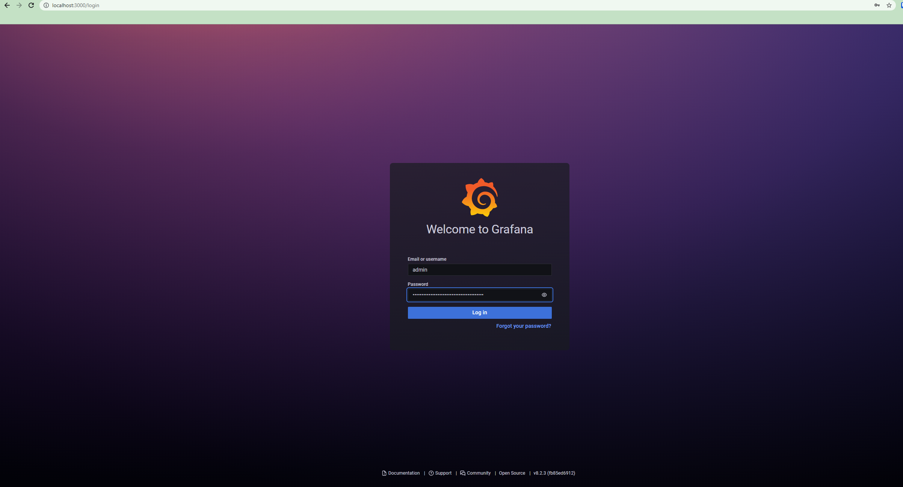

# Introduction

In this post I will go thru the steps needed to install [Grafana](https://grafana.com/) in AKS as well as explaining what is Grafana used for and how it looks after installed.

# What is Grafana

To start this post let's first focus on what is Grafana and what is it used for. Grafana is a monitoring tool very widely used because of it's simplicity and power, you can monitor basically anything because of it's many datasources and it comes with an alert engine to send out notifications when a certain threshold is met.  
It's configuration is not complicated and you can even version the dashboards you make in Grafana, but we will also cover in this post a powershell module that can help automate the creation of dashboards and panels in Grafana (At this moment it only supports Azure resources but I will work in add other datasources like Prometheus) this module is called [PowerGrafana](https://www.powershellgallery.com/packages/PowerGrafana/0.1.0).

# How to install it

To install Grafana you have multiple options:

 - Run a VM with Grafana installed inside
 - Run Grafana as a container in a VM
 - Deploy a Grafana container inside a Kubernetes cluster deploying the resources by yourself
 - Deploy a Grafana container inside a Kubernetes cluster using Helm Charts (we are going to use this one)

This post will cover the deployment of Grafana as a Helm Chart as we did in the post about Prometheus, I will link an article about a deeper explanation on Helm Charts in the near future to go thru the benefits of Helm Charts and specially how to adjust them to cover your particular needs.

To quickly start with this let's go and add the repository and update our repository list.


And now we can check the Charts we have in the repository we just added, let's take a look.  



Perfect! we are ready to start working!

# Prerequisites

Well for this article we will need:

- An AKS cluster up and running, nothing special, just the base deployment is fine, you can follow this [tutorial](https://docs.microsoft.com/en-us/azure/aks/kubernetes-walkthrough-portal)

- A terminal with kubectl and helm installed 

- Install the grafana helm repository

# Installation

Since we want to keep our grafana resources in a separate namespace to have a better view of what was created, we will start by creating a namespace called `monitoring`

```bash
kubectl create namespace monitoring
```


**You can see here I use `kubens` to switch to the monitoring namespace, this is a very cool tool that makes your work with kubernetes easy by changing your namespace to the one you define so your next commands doesn't need to include the namespace on them**


```bash
helm search repo grafana
```



Nice!, lot's of charts there, you can see there are charts for multiple solutions, including Grafana Enterprise, Loki (focused on logs more than metrics) and the base `grafana` one, that's the one we will be using, let's install it.

```bash
helm install grafana grafana/grafana
```



Here we can see the helm command completed and we can notice several things, let's go over them one by one:

### Warnings about deprecations:

```
W1115 09:12:11.499698    9800 warnings.go:70] policy/v1beta1 PodSecurityPolicy is deprecated in v1.21+, unavailable in v1.25+
W1115 09:12:11.529960    9800 warnings.go:70] policy/v1beta1 PodSecurityPolicy is deprecated in v1.21+, unavailable in v1.25+
W1115 09:12:12.040639    9800 warnings.go:70] policy/v1beta1 PodSecurityPolicy is deprecated in v1.21+, unavailable in v1.25+
W1115 09:12:12.040639    9800 warnings.go:70] policy/v1beta1 PodSecurityPolicy is deprecated in v1.21+, unavailable in v1.25+
```
This is because my kubernetes cluster is running version v1.21.2 which means the `PodSecurityPolicy kind of resource for the apiVersion v1beta1` is deprecated in my version and will be completely removed in the version v1.25 of kubernetes, this is something to cover in the post about helm, I will link it at the end of this article as soon as it is finished, but for now we don't need to worry about this.


### Grafana admin password:

Of course, the initial setup needs to configure a default password for the admin account, after your first login you must change this password but to get what this initial password is you need to retrieve it from a `secret`, and then decode it (secrets are stored encoded as base64)

```bash
kubectl get secret --namespace monitoring grafana -o jsonpath="{.data.admin-password}" | base64 --decode ; echo
```

This command will first retrieve the secret called `grafana` and from it will take the `admin-password` data, decode it and output to the terminal, let's see what it looks like:

***If you don't have base64 installed in your system you can use brew (linux, macos) or chocolatey (windows)***

***I am running the commands in Windows so I should run:***
```bash
kubectl get secret --namespace monitoring grafana -o jsonpath="{.data.admin-password}" | base64 -d
```
and my output is `xzUvc2esXl2aSivqhQQ5X3ZZ01TZ2HMCEPdpWVSJ` so that's the password of my admin account in the Grafana deployment I just installed.

### Accessing our Grafana!

The last step is how to reach our Grafana instance, and it states that we can access it reaching the service called `grafana.monitoring.svc.cluster.local` but that will work if you are running kubernetes locally, in my case I am running an AKS cluster in the cloud, which meands I need to port forward the port 3000 of the Grafana server pod to my localmachine port 3000 (or any other port that is not in use), to do this port-forward I need the `pod name` which we can get by running this:

`kubectl get pods --namespace monitoring -l "app.kubernetes.io/name=grafana,app.kubernetes.io/instance=grafana" -o jsonpath="{.items[0].metadata.name}"`

**Why do I use port 3000 and not 80 as stated in the output of the helm install command?, that is because the `service` will listen in port 80 as the snippet states, but the pods listes in port 3000 which is the default port for Grafana and since I am accessing the pod directly I need to use the pod port (3000) instead of the service port (80)**

This will get the pods in namespace `monitoring` that matches the labels `name=grafana` and `instance=grafana` then it will apply a jsonpath query to extract the name of the pod, in my case that is `grafana-5c999c4fd5-czxdw`.  

Now we can simply do a:  
```bash
kubectl port-forward grafana-5c999c4fd5-czxdw 3000:3000
```



Use the username `admin` and the password you got in the step 1 of the instructions of the helm chart.

To this point Grafana is fully configured but keep in mind that his installation is very basic, it will not persist (keep) your dashboards or any other configuration if the pod is killed, and this only has one single pod.

All this can changed by downloading the Chart locally with `helm pull grafana/grafana --untar` and then adjusting our needs in there. If you do this you will notice the fact that there is no persistance once the pod is killed is because the storage for the `/var/lib/` directory (where all grafana config is stored) is an `EmptyDir` which is a very quick way to give the pod some place where to store data but it will be removed when the pod dies.

I will cover more on how to customize Helm Charts locally in the post about that in the near future.


# Final words

I hope the explanation was clear and you have now the basics to start playing around with Grafana, if you liked this post, please feel free to leave a comment and/or share it!. Thank you for reading :blush:
