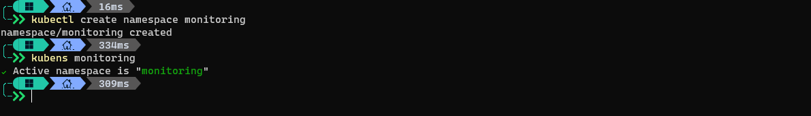
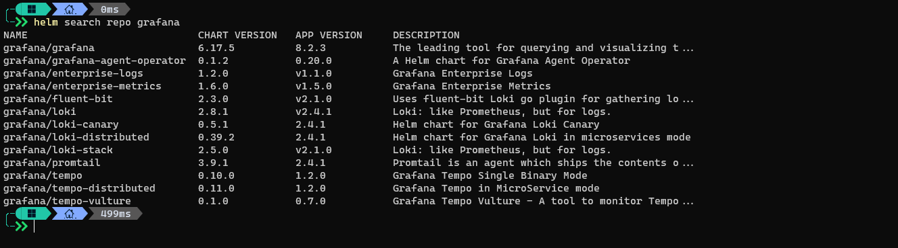
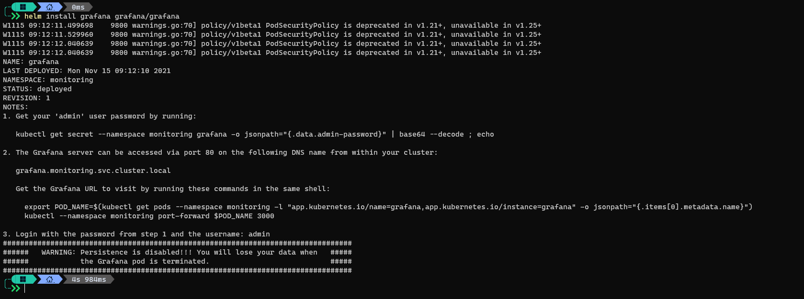
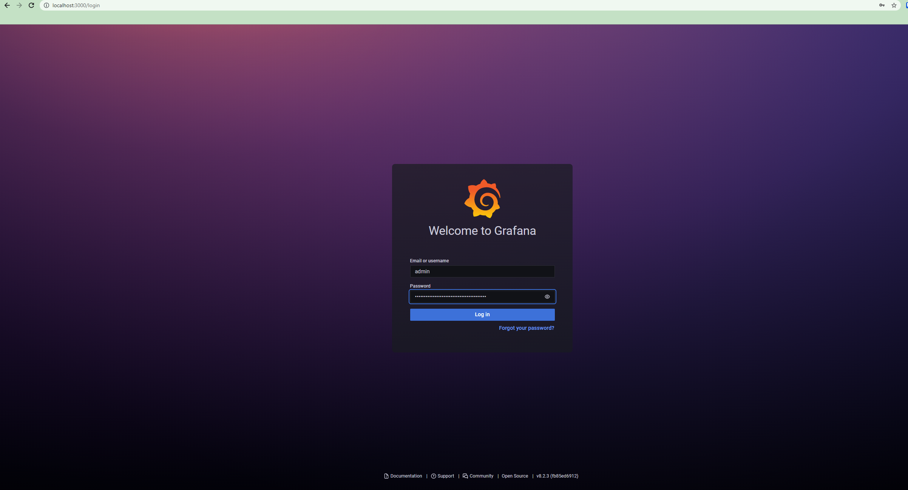

## Introducción

En este post vamos a ver como instalar [Grafana](https://grafana.com/) de forma sencilla usando Helm Charts, también vamos a ver que es y como se usa Grafana

## Que es grafana?

Vamos a empezar por explicar que es exactamente Grafana y para que podemos usarlo. Grafana es un software de monitoreo muy ampliamente utilizado para todo tipo de ambientes, se puede utilizar en tu casa para monitorear tu smart home (como consumos eléctricos, de gas o luminosidad a lo largo del día) como también en una empresa para identificar utilizacion de recursos, consumo de CPU y memoria por parte de máquinas virtuales o contenedores, etc.
Grafana puede interactuar con múltiples orígenes de datos gracias a sus "datasources" que son adicionales que se pueden instalar en Grafana para poder consumir metrics y logs de distintas fuentes.
Es importante aclarar que Grafana no produce ni modifica metrics ni logs, simplemente los consume y los muestra de una forma amigable con el usuario.
Normalmente, la creación de dashboards, paneles y otros recursos en Grafana es hecho a mano por medio de su panel de administración lo cual puede ser tedioso a veces cuando tenemos que deployar algunos componentes en la nube que van a estar por algún tiempo y queremos monitorearlos, pero a los pocos días los destruiremos, para tareas como esas podemos usar [PowerGrafana](https://www.powershellgallery.com/packages/PowerGrafana/0.1.0) que es un módulo de PowerShell que puede crear dashboards, paneles y targets de forma programática.


## Como instalarlo

Para instalar Grafana tenemos varias opciones, dependiendo de nuestras necesidades podemos elegir entre:

- Correr una máquina virtual e instalar Grafana dentro como un binario
- Podemos correr Grafana como un container, esto puede ser dentro de una máquina virtual o en un ambiente de containers
- Podemos deployar Grafana en Kubernetes de forma manual (nosotros creamos el pod y el servicio básico para que funcione)
- Deployamos Grafana en Kubernetes usando un Helm Chart (vamos a explorar esta opción en este post)

Vamos a continuar con el uso de Helm Charts porque realmente creo que es LA forma en la que se deben deployar aplicaciones en Kubernetes, es mucho mas simple de mantener, mas manejable su configuración y además nos permite muy fácilmente deployar la misma aplicación con la misma configuración en múltiples clusters sin ningún cambio.

Para comenzar vamos a agregar el repositorio de Grafana y correr un `helm repo update` para actualizar la lista de repositorios en nuestra máquina.


Ahora podemos inspeccionar ese repositorio y ver que Charts tenemos disponibles, veamos:


Genial, tenemos el Chart que necesitamos `Grafana`, pero también tenemos en el mismo repositorio otras configuraciones de Grafana para distintos propósitos, continuemos.

## Prerrequisitos

Como prerrequisitos vamos a necesitar muy pocas cosas:

- Nuestro cluster de kubernetes
- Un `namespace` en nuestro cluster
- Una terminal de nuestra preferencia (bash, zsh, powershell) con kubectl y helm instalados
- El repositorio de Grafana agregado en nuestro Helm local (como hicimos en el paso anterior)


## Instalación

Para este ejercicio vamos a instalar los recursos de Grafana en un `namespace` separado, lo vamos a llamar `monitoring`, para eso ejecutamos:

```bash
kubectl create namespace monitoring
```


**En mi terminal tengo instalado kubens que es una aplicación que nos permite setear el namespace en el que vamos a trabajar cuando ejecutemos kubectl y de esta forma nos ahorramos tener que especificar el `-n namespace` con cada comando**

Ahora veamos nuevamente la lista de charts que agregamos:

```bash
helm search repo grafana
```



Perfecto, vemos que hay muchos charts además del que necesitamos, esto es porque en el mismo repositorio de Helm se distribuyen otras configuraciones de grafana (combinaciones e Grafana con otros productos).   

Vamos a instalar el chart de Grafana:

```bash
helm install grafana grafana/grafana
```



Vemos que el comando instalo el chart de Grafana y ya nos esta indicando algunas cosas que son interesantes, veamos que son:

### Warnings:

```
W1115 09:12:11.499698    9800 warnings.go:70] policy/v1beta1 PodSecurityPolicy is deprecated in v1.21+, unavailable in v1.25+
W1115 09:12:11.529960    9800 warnings.go:70] policy/v1beta1 PodSecurityPolicy is deprecated in v1.21+, unavailable in v1.25+
W1115 09:12:12.040639    9800 warnings.go:70] policy/v1beta1 PodSecurityPolicy is deprecated in v1.21+, unavailable in v1.25+
W1115 09:12:12.040639    9800 warnings.go:70] policy/v1beta1 PodSecurityPolicy is deprecated in v1.21+, unavailable in v1.25+
```

Esos warnings suelen aparecer en varios Charts, se deben a que la API de Kubernetes está en constante evolución y muchas veces algunos features van mutando y se van deprecando en favor de otros, estos warnings en particular hacen referencia a que resource kind `PodSecurityPolicy` está deprecado en la versión 1.21 de Kubernetes y va a ser totalmente removido en la versión 1.25 (mi clúster corre 1.22), por lo que hasta que actualice a 1.25, esto va a seguir funcionando, pero si actualizo mi clúster (o deployo este chart) a 1.25, este resource kind no va a existir más y por ende el chart va a fallar.


### Password de admin de grafana:

Ni bien terminemos de instalar Grafana, vamos a querer loguearnos en su dashboard, para esto necesitamos el password del usuario `admin` y este password la podemos encontrar en un `secret` en el mismo deploy (en el mismo namespace), el comando que nos muestra `helm install` es lo que debemos hacer para conocer el password (Este password se guarda como todos los secrets en Kubernetes como un `base64 encoded string`)

```bash
kubectl get secret --namespace monitoring grafana -o jsonpath="{.data.admin-password}" | base64 --decode ; echo
```

Con este comando vamos a obtener el secret primero y luego vamos a pasárselo al comando `base64` para que lo decodifique y nos lo muestre.

***Si no tienen el comando base64, pueden simplemente usar brew (Linux y MacOS) o chocolatey (Windows)***

***Dado que estoy corriendo estos comandos en Windows, mi ejemplo es:***
```bash
kubectl get secret --namespace monitoring grafana -o jsonpath="{.data.admin-password}" | base64 -d
```

Y en mi caso el output es `xzUvc2esXl2aSivqhQQ5X3ZZ01TZ2HMCEPdpWVSJ`, ese es el password de mi usuario `admin`, este valor va a ser distinto en cada caso.

### Accediendo Grafana por primera vez!

El último paso es acceder a Grafana, nos menciona que podemos acceder a grafana por medio del service `grafana.monitoring.svc.cluster.local`, pero esto solo funcionaria en caso de que estén corriendo el clúster de kubernetes de forma local en sus máquinas, en caso de que estén corriendo el clúster en la nube (como en mi caso) tienen que hacer un port-forward del puerto 3000 (el puerto default de Grafana) del pod a algún puerto que no estén usando en sus máquinas (podemos usar el 3000 también por practicidad), para esto necesitamos averiguar el nombre del pod, lo podemos hacer simplemente corriendo `kubectl get pod` o de forma más especifica `kubectl get pods --namespace monitoring -l "app.kubernetes.io/name=grafana,app.kubernetes.io/instance=grafana" -o jsonpath="{.items[0].metadata.name}"`

Este comando nos va a decir el nombre del pod de grafana en el namespace `monitoring` que tenga los labels `name=grafana` y `instance=grafana`, en mi caso esto es `grafana-5c999c4fd5-czxdw`.

Ahora podemos hacer:
```bash
kubectl port-forward grafana-5c999c4fd5-czxdw 3000:3000
```



Usamos `admin` como usuario y  el password que obtuvimos antes como password `xzUvc2esXl2aSivqhQQ5X3ZZ01TZ2HMCEPdpWVSJ`

En este punto tenemos Grafana instalado y configurado en nuestro clúster, tengan en cuenta que esta configuración de Grafana es muy simple y guarda toda la información sobre Dashboards y DataSources en un storage de tipo `EmptyDir` que es un tipo de storage volátil (cuando el pod se destruye, el storage también por lo que obtenemos un pod nuevo con un storage nuevo cada vez que matemos el pod, perdiendo toda la configuración que realicemos).

Si queremos cambiar este comportamiento, lo que debemos hacer es descargar el chart a nuestra máquina y ajustarlo para que en lugar de un `EmptyDir` utilice una storage class que nos dé persistencia. En un próximo artículo sobre Helm Chart voy a avanzar sobre como se puede hacer esto y mucho más.

# Por último

Espero que esta explicación ayude a conocer lo básico de como instalar Grafana usando Helm Charts, si este post te fue útil, por favor compártelo con otros y si tienes sugerencias para más contenido o mejoras, por favor hacémelo saber en los comentarios de este post. ¡Muchas gracias!