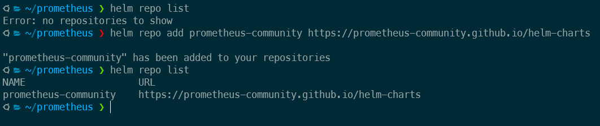
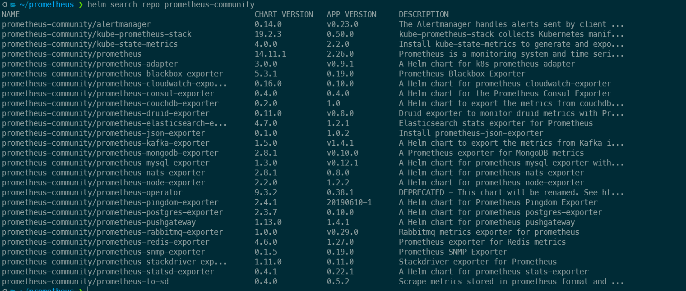
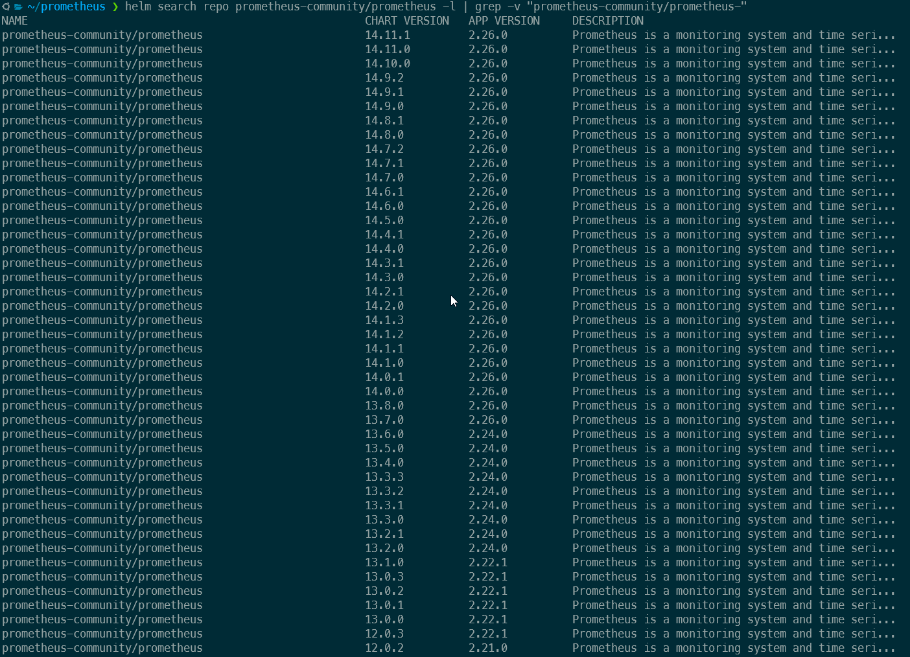
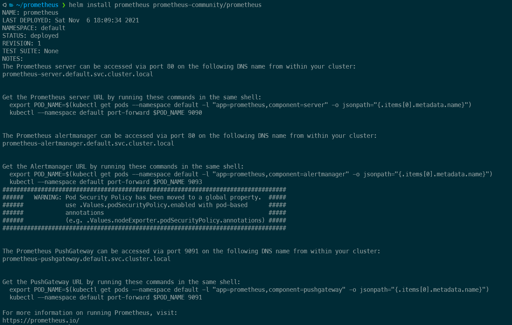
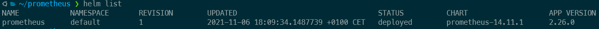
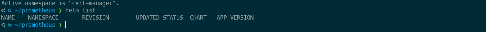
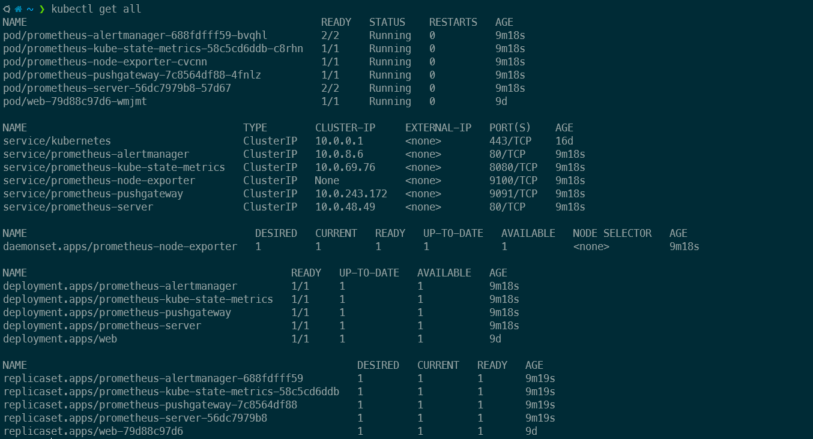
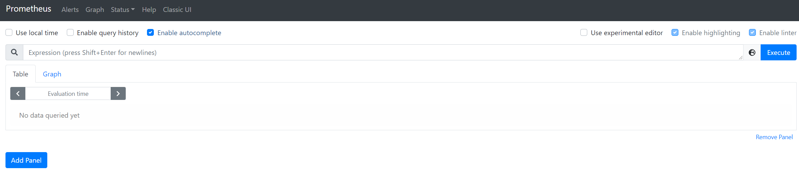
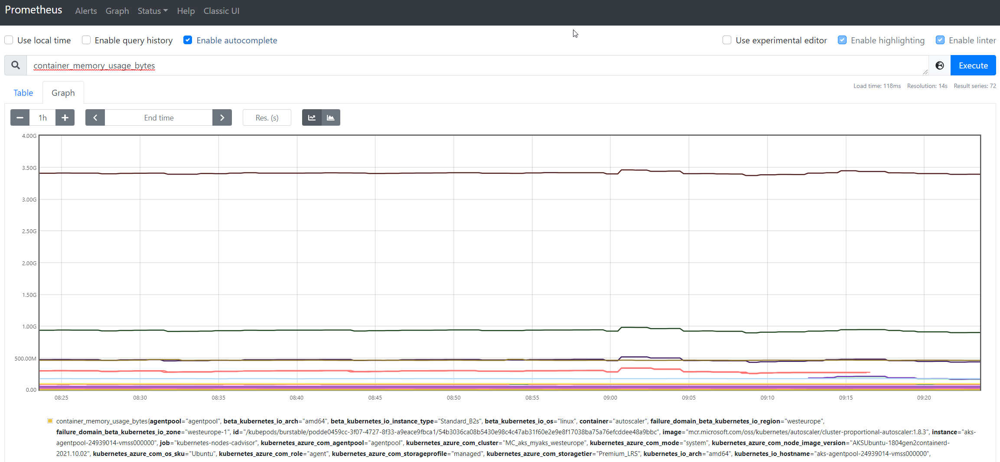

# Introduction

The main intention of this post (as well as the others) is not to have a very deep tutorial in all the details of each technology/application that is described but a short and concise guide for something particular that can help people that are starting to know the topic described in this article, of course if you have any recommendation to make this better, just feel free to drop me a message/comment.

# What is Prometheus

So, let's jump directly to what we will be talking today here, [Prometheus](https://prometheus.io/) is a monitoring tool that is very popular in Kubernetes world as is one of the CNCF (Cloud Native Computing Foundation) projects and this means is a very mature product with a big support in the community.

There are several characteristics that make Prometheus one of the favorites tools to monitor environments, some are listed here:

- Pull methodology (Means the Prometheus server pulls for metrics instead of waiting for the application to push metrics to Prometheus server)

- Very fast when collecting metrics and doing aggregation

- An architecture that allows to monitor not only Kubernetes environments but other applications like databases or web servers (using exporters)

- Supports for hundreds of applications, hardware, platforms, etc. to monitor [here is the list](https://prometheus.io/docs/instrumenting/exporters/)

With this in mind, let's continue to install it and configure it for a first try.

# How to install it

For our example, we will install Prometheus in an [AKS cluster](https://azure.microsoft.com/en-us/services/kubernetes-service/) (Kubernetes cluster running as a PaaS in Azure).

There are multiple ways to deploy Prometheus in a Kubernetes cluster but the simplest one and the one that makes more sense is to use something called Helm chart, think of Helm Charts as a set of YAML files linked as a single resource to be deployed, this means that you install it as a "single" item (one chart) but it will instead deploy the needed resources in your cluster to make the solution work properly (think of pods, replica sets, deployments, services, secrets, etc.)


# What is Helm

Helm is a technology that allows us to package a bunch of YAML files that will be used as a whole to make a solution to work (in this case the solution is Prometheus), by using Helm you are removing the complexity of needing to manage independently all the resources to make the solution work, instead you provide a configuration file to the chart and deploy the chart, that will create all the resources for you and configure them properly.

One of the advantages of using Helm is that you can rely on repositories where those charts are being maintained and use them, but you could also want to keep your own version of the chart locally or in a private repository, so you can tune it to match your needs (like using a custom docker image in the chart instead of using the default one, think of security needs for example)

Another characteristic is that you can store those charts in the same repositories where you store your container images and version them the same way you do with a container image.

Each chart has its own set of files because they represent a group of resources that work to make an application to work, so the resources required for a helm chart for Prometheus are not the same resources required for cert-manager for example, but the idea is the same, a set of YAML files that once deployed will work together to make the application to run.

In order to use helm charts you require to have helm installed in your system and add the repositories that you will be using, each helm chart lives in a repository that you require to add in order to retrieve the chart and it's files.


*adding a repository*

For this article we will use the default Prometheus helm chart

# Prerequisites

Well for this article we will need:

- An AKS cluster up and running, nothing special, just the base deployment is fine, you can follow this [tutorial](https://docs.microsoft.com/en-us/azure/aks/kubernetes-walkthrough-portal) (I will make a tutorial in the future) 

- A terminal with kubectl and helm installed 

- Install the prometheus-community helm repository

# Installation

The first thing we will do is to add the prometheus-community helm repository and update our local repository list by running the following command:

```bash
helm repo add prometheus-community https://prometheus-community.github.io/helm-charts 
helm repo update
```

Now we can check all the charts that we can install now that we added the repository, let's see:

```bash
helm search repo prometheus-community
```



Perfect! We see a lot of charts there, those are different elements that we can install, but today we will focus on the one called "prometheus"

You see there is a column names **CHART VERSION**, this is the version of the chart itself and not of Prometheus, this is because you can make modifications in the way the chart is composed and what is inside it but still use the same version of Prometheus as the chart version before. You can see all the chart versions by running:

```bash
helm search repo prometheus-community/prometheus -l | grep -v "prometheus-community/prometheus-"
```
*The grep is to remove all the other charts from the list*



If you install Prometheus without telling the version of the chart that you want, it will install the latest (14.11.1 at the moment I write this article).

Let's install it now:

```bash
helm install prometheus prometheus-community/prometheus
```
*the "prometheus" before the name of the repository/chart is the name we want to give to this deployment, you can choose another name.



Now we have our Prometheus server installed and ready, let's check in Kubernetes what we got deployed (I had the "default" namespace selected while installing the chart, so my chart was deployed in the "default" namespace)

**One important thing is that when you install a helm chart, it gets installed in a namespace in Kubernetes, if you change to another namespace and try to see the installed charts, you will not see the one you installed in the other namespace. Let me put this in an image to explain better:**

*This is a `helm list` in my "default" namespace


*This is a `helm list` in another namespace


In Kubernetes we can see all the resources created automatically:

```bash
kubectl get all
```


Following the steps described after the installation of the helm chart, we should forward a port from our machine to the pod where Prometheus server is running with:

```bash
export POD_NAME=$(kubectl get pods --namespace default -l "app=prometheus,component=server" -o jsonpath="{.items[0].metadata.name}")

kubectl --namespace default port-forward $POD_NAME 9090
```

**If you are using WSL to run your Kubernetes commands, you need to do some extra steps for this to work**
- First check what's the IP of your WSL by running `wsl hostname -I` as you can't access the ports in your host machine (windows) by running localhost:port if you are exposing the ports inside WSL.
- Second, the port-forward command should include --address 0.0.0.0 like `kubectl --namespace default port-forward --address 0.0.0.0 $POD_NAME 9090`
- Third, you should use the WSL IP (the one from step one) instead of `localhost` to access Prometheus

With this we can now go to our browser and access `localhost:9090` to see this dashboard:



Prometheus has a lot of default metrics getting collected by default, to check them you can start writing something in the search box, and it will autocomplete with available metrics.

As an example:



And now, the only thing that is left is to dig into the metrics Prometheus is collecting, maybe adding some exporters, configure alert manager maybe? (this is a topic for another post), consume those metrics from Grafana? (Article about this is already in the queue :wink: ) 

# Final words

I hope this helps you to get started with Prometheus as it is very simply to implement and at the same time very powerful, if you have any problem following this guide or any recommendation, please let me know in the comments section.

