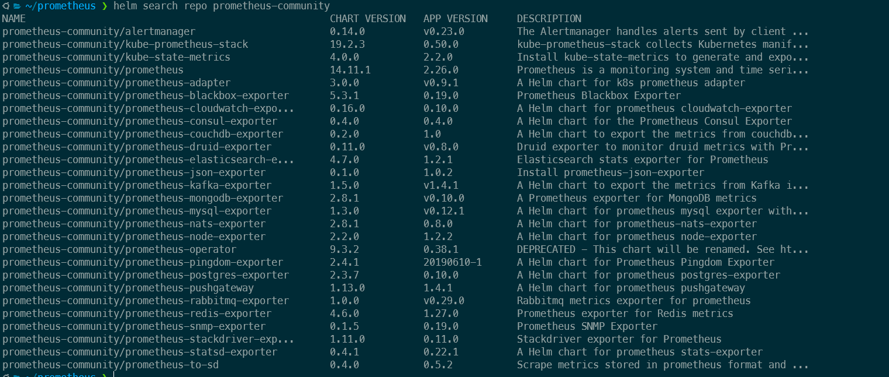
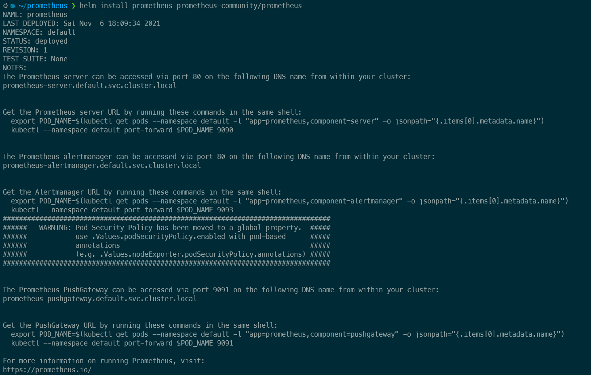
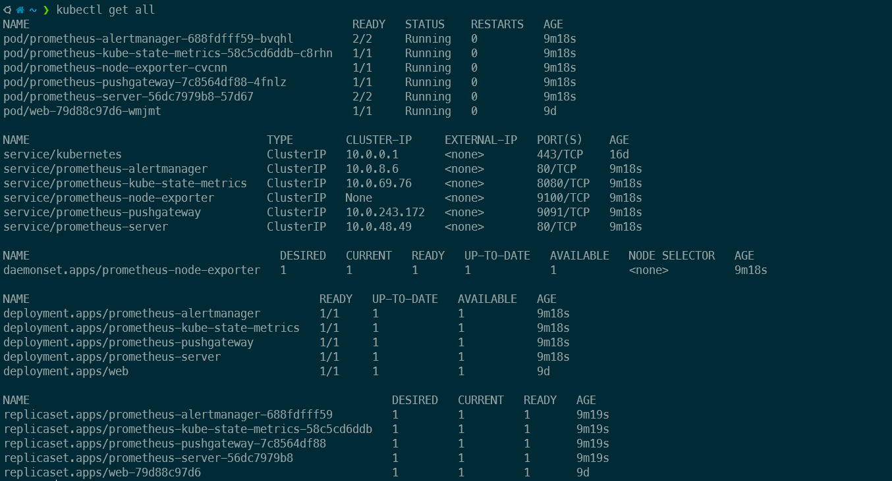
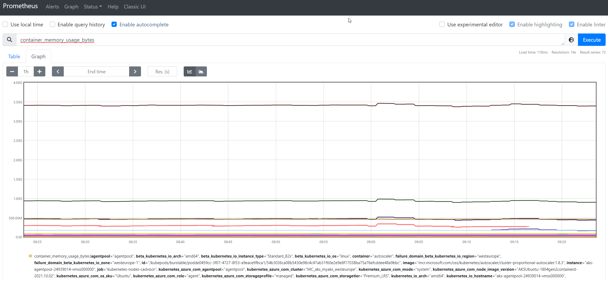

# Introducción

La intención principal de esta publicación (así como de las demás) no es tener un tutorial muy profundo en todos los detalles de cada tecnología/aplicación que se describe, sino una guía breve y concisa de algo en particular que puede ayudar a las personas que están comenzando a conocer el tema descrito en este artículo, por supuesto, si tenés alguna recomendación para mejorar esto, no dudes en enviarme un mensaje/comentario.

# ¿Qué es Prometheus?

Arranquemos, vayamos directamente al tema que estaremos hablando hoy acá, [Prometheus](https://prometheus.io/) es una herramienta de monitoreo que es muy popular en el mundo de Kubernetes al igual que una de los proyectos de la CNCF (Cloud Native Computing Foundation) y esto significa que es un producto muy maduro con un gran apoyo de la comunidad.

Hay varias características que hacen de Prometheus una de las herramientas favoritas para monitorear entornos, algunas se enumeran aquí:

- Metodología "pull" (significa que el servidor de Prometheus extrae métricas en lugar de esperar a que la aplicación envíe las métricas al servidor de Prometheus)

- Muy rápido al recopilar métricas y realizar agregaciones

- Una arquitectura que permite monitorear no solo los entornos de Kubernetes sino otras aplicaciones como bases de datos o servidores web (usando "exporters")

- Soporta cientos de aplicaciones, hardware, plataformas, etc. para monitorear [aquí está la lista](https://prometheus.io/docs/instrumenting/exporters/)

Con esto en mente, continuemos instalándolo y configurándolo para un primer intento.

# Cómo instalarlo

Para nuestro ejemplo, instalaremos Prometheus en un [clúster de AKS](https://azure.microsoft.com/en-us/services/kubernetes-service/) (clúster de Kubernetes que se ejecuta como PaaS en Azure).

Hay varias formas de implementar Prometheus en un clúster de Kubernetes, pero la más simple y la que tiene más sentido es utilizar algo llamado Helm charts, imagina a un Helm chart como un conjunto de archivos YAML vinculados como un único recurso para implementar, esto significa que lo instala como un elemento "único" (un chart) pero, en su lugar, implementará los recursos necesarios en tu clúster para que la solución funcione correctamente (como pods, replica sets, deployments,  services,  secrets, etc.)


# Qué es Helm

Helm es una tecnología que nos permite empaquetar un montón de archivos YAML que se usarán como un todo para hacer que una solución funcione (en este caso, la solución es Prometheus), al usar Helm estás eliminando la complejidad de tener que administrar de forma independiente todos los recursos para que la solución funcione, en su lugar, proporcionas un archivo de configuración al chart y lo implementás, que creará todos los recursos y los configurará correctamente.

Una de las ventajas de usar Helm es que se puede confiar en los repositorios donde se mantienen esos charts y usarlos, pero también si querés podés mantener tu propia versión del chart localmente o en un repositorio privado, para que puedas ajustarlo a tus necesidades (como usar una imagen de container personalizada para los deployments del chart en lugar de usar la predeterminada, esto podría ser un requerimiento de seguridad, por ejemplo)

Otra característica es que se puede almacenar esos charts en los mismos repositorios donde se almacenan sus imágenes de contenedor y versionarlos de la misma manera que lo haces con una imagen de contenedor.

Cada chart tiene su propio conjunto de archivos porque representan un grupo de recursos que funcionan para hacer que una aplicación funcione, por lo que los recursos necesarios para un chart  para Prometheus no son los mismos recursos necesarios para cert-manager, por ejemplo, pero la idea es la misma, un conjunto de archivos YAML que una vez implementados trabajarán juntos para hacer que la aplicación se ejecute.

Para utilizar los charts de helm, tenés que tener helm instalado en tu sistema y agregar los repositorios que utilizará, cada chart de helm vive en un repositorio que se debe agregar para descargar el chart y sus archivos.


* agregando un repositorio *

Para este artículo usaremos los charts de Prometheus estándar.

# Requisitos previos

Bueno, para este artículo necesitaremos:

- Un clúster de AKS en funcionamiento, nada especial, solo la implementación base está bien, podés seguir este [tutorial](https://docs.microsoft.com/en-us/azure/aks/kubernetes-walkthrough-portal) (Haré un tutorial en el futuro)

- Una terminal con kubectl y helm instalados

- Instala el repositorio de helm de prometheus-community

# Instalación

Lo primero que haremos es agregar el repositorio de helm de prometheus-community y actualizar nuestra lista de repositorios locales ejecutando el siguiente comando:

```bash
helm repo add prometheus-community https://prometheus-community.github.io/helm-charts
helm repo update
```

Ahora podemos revisar todos los gráficos que podemos instalar ahora que agregamos el repositorio, veamos:

```bash
helm search repo prometheus-community
```



¡Perfecto! Vemos muchos charts allí, esos son elementos diferentes que podemos instalar, pero hoy nos centraremos en el llamado "prometheus".

Hay un nombre de columna ** CHART VERSION **, esta es la versión del gráfico en sí y no de Prometheus, esto se debe a que se pueden realizar modificaciones en la forma en que está compuesto el gráfico y lo que hay dentro, pero aun así usar la misma versión de Prometheus que la versión de gráfico anterior. Se pueden ver todas las versiones de charts ejecutando:

```bash
helm search repo prometheus-community/prometheus -l | grep -v "community-prometheus/prometheus-"
```
* El comando grep es para eliminar todos los demás charts de la lista *


Si instalas Prometheus sin decir la versión del gráfico que deseas, se instalará la última (14.11.1 en el momento en que escribo este artículo).

Vamos a instalarlo ahora:

```bash
helm install prometheus prometheus-community/prometheus
```
* el "prometheus" antes del nombre del repositorio/gráfico es el nombre que queremos darle a esta implementación, podés elegir otro nombre.



Ahora que tenemos nuestro servidor Prometheus instalado y listo, verifiquemos en Kubernetes lo que implementamos (tenía el espacio de nombres "default" seleccionado al instalar el gráfico, por lo que mi gráfico se implementó en el espacio de nombres "default")

** Una cosa importante es que cuando instala un gráfico de helm, se instala en un namespace en Kubernetes, si cambia a otro namespace e intentas ver los gráficos instalados, no verás el que instalaste en el otro namespace. Dejame poner esto en una imagen para explicarlo mejor: **

* Esto es un `helm list` en mi namespace" default "


* Esto es un `helm list` en otro namespace


En Kubernetes podemos ver todos los recursos creados automáticamente:

```bash
kubectl get all
```


Siguiendo los pasos descritos después de la instalación del gráfico de helm, debemos reenviar un puerto desde nuestra máquina al pod donde se ejecuta el servidor Prometheus con:

```bash
export POD_NAME=$(kubectl get pods --namespace default -l "app=prometheus, component=server" -o jsonpath="{. items [0].metadata.name}")

kubectl --namespace default port-forward $POD_NAME 9090
```

** Si estás utilizando WSL para ejecutar tus comandos de Kubernetes, debes realizar algunos pasos adicionales para que esto funcione **
- Primero verifica cuál es la IP de tu WSL ejecutando `wsl hostname -I`, ya que no se puede acceder a los puertos en tu máquina host (Windows) ejecutando localhost: port si está exponiendo los puertos dentro de WSL.
- En segundo lugar, el comando port-forward debe incluir --address 0.0.0.0 como `kubectl --namespace default port-forward --address 0.0.0.0 $POD_NAME 9090`
- En tercer lugar, debe usar la IP de WSL (la del paso uno) en lugar de `localhost` para acceder a Prometheus

Con esto ahora podemos ir a nuestro navegador y acceder a `localhost: 9090` para ver este dashboard:


Prometheus tiene muchas métricas predeterminadas que se recopilan de forma predeterminada, para verlas, podes comenzar a escribir algo en el cuadro de búsqueda y se completará automáticamente con las métricas disponibles.

Como ejemplo:



Y ahora, lo único que queda es profundizar en las métricas que Prometheus está recopilando, tal vez agregando algunos exportadores, ¿configurar el administrador de alertas tal vez? (este es un tema para otra publicación), ¿consumir esas métricas desde Grafana? (El artículo sobre esto ya está en camino : guiño :)

# Últimas palabras

Espero que esto te ayude a comenzar con Prometheus, ya que es muy simple de implementar y al mismo tiempo muy poderoso, si tenés algún problema siguiendo esta guía o alguna recomendación, hacémelo saber en la sección de comentarios.
