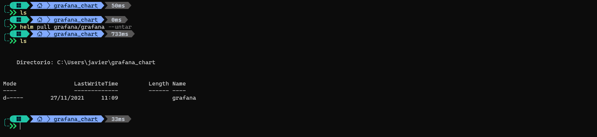

# Introducción 

En esta ocasión vamos a estar viendo como trabajar con Helm Charts, en mis anteriores artículos sobre Prometheus y Grafana hablamos un poco sobre los Helm Charts, pero no mucho en detalle.  
En este articulo voy a descargar el chart de Grafana y vamos a ver como podemos modificarlo para que se ajuste a nuestras necesidades.  

# Que son los charts?

En el mundo de Kubernetes a menudo nos encontramos con que tenemos aplicaciones corriendo en algunos pods, servicios para esos pods, probablemente un ingress controller para exponer esta aplicación al mundo exterior y podemos tener secrets, configmaps, volúmenes u otros recursos de Kubernetes. A medida que nuestra aplicación va creciendo en componentes y complejidad nos encontramos con que tenemos cada vez mas cantidad de archivos yaml (o yml) pero nuestra aplicación es "una sola" compuesta de multiples archivos, manejar todos estos archivos por separado siendo "una sola entidad" es complicado. Es por esto que aparecen los Helm Charts como una forma de simplificar esto al reunir en una sola entidad (un chart) todos los componentes a desplegar, una segunda ventaja es que podemos hacer "templating" de estos archivos yaml de forma que tomen un valor de un archivo de configuración, haciendo aun mas fácil la configuración del chart. Veamos como es esto.

# Viendo los charts disponibles en un repositorio

Como primer paso vamos a agregar el repositorio de Grafana (como un ejemplo, estos pasos aplican para cualquier helm chart).

Y vamos a ver que charts hay disponibles en el repositorio

Vamos a concentrarnos en el chart llamado `grafana/grafana` que es el que usamos en nuestra instalación de Grafana en otro articulo y que despliega los componentes básicos para una implementación de Grafana minima.

Lo siguiente que tenemos que hacer es ir a un directorio donde queramos descargar nuestro chart y correr el comando `helm pull grafana/grafana --untar` esto va a descargar el chart a un directorio llamado `grafana` con todos los archivos necesarios dentro.  

Y dentro de este directorio están los archivos que componen el chart

# Empecemos a ver que hay dentro de un chart

Lo primero que podemos ver es un archivo llamado `Chart.yaml`, este archivo contiene la descripcion del chart que acabamos de descargar

Vemos información como la version del Chart, la URL del proyecto al que pertenece el chart y algo mas como quien mantiene el chart, etc.

Luego vemos una estructura de directorios

El único directorio que siempre vamos a encontrar en un chart es `templates` ya que en este directorio es que vamos a poner todos los archivos yaml que componen nuestra solución. Los demás directorios son necesarios para Grafana, en otros charts podemos encontrar otros directorios, pero siempre tengan en cuenta que los templates que forman los recursos en Kubernetes están en el directorio `templates`.

Por ultimo en el directorio donde descargamos el chart vamos a encontrar un archivo llamado `values.yaml` , este archivo es el corazón de la configuración de un chart, en este archivo vamos a encontrar todos los parámetros que son configurables para nuestro chart (y si lo deseamos podemos agregar mas configuraciones en este archivo que luego podemos usar en los yaml del directorio `templates`).

# Como son los templates en un chart

Básicamente un template es un archivo yaml que contiene instrucciones para que al momento de desplegar nuestro chart, los valores finales a implementar sean tomados de un archivo de configuración (values.yaml) y no tengamos que hardcodear un valor en el template. Veamos un ejemplo:  

En el archivo `deployment.yaml` podemos encontrar esto:

Donde en la línea 18 hace referencia a `.Values.replicas` esta es la forma en la que le decimos a Helm que para el valor del atributo `replicas` de este yaml, tome el valor que tenemos en el archivo `values.yaml` con la key `replicas`. El archivo `values.yaml` se ve así:

En la línea 24 de `values.yaml` podemos ver que dice `replicas : 1` si desplegamos este chart así, veremos que tenemos sola replica del pod `grafana`

Pero si modificamos este valor y ponemos 3, guardamos el archivo `values.yaml` y aplicamos el chart nuevamente, veremos que ahora tenemos 3 replicas de nuestro pod `grafana`

Esto mismo podemos aplicarlo para cualquier configuración, de esta forma podemos alterar nuestra aplicación simplemente actualizando valores en `values.yaml` y corriendo un `helm upgrade grafana .` (si estamos en el directorio donde tenemos nuestro chart descargado)

**Algo super interesante es que estos charts también podemos almacenarlos en los repositorios donde almacenamos nuestras imágenes de containers, de esta forma podemos versionarlos juntos con nuestras imágenes de containers y hacer un pull desde donde lo necesitemos.**

# Mas allá de la configuración básica

En `values.yaml` van a encontrar muchas líneas comentadas, si las des comentan van a estar habilitando nuevas configuraciones del chart, esto se debe a que helm nos permite poner código condicional en nuestros templates, algo como "si existe el bloque X desplegar Y recurso en Kubernetes". Un ejemplo de esto es el ingress controller de Grafana. 
En la línea 181 de `values.yaml` dice "enabled: false" y en el archivo `ingress.yaml` en la línea 1 dice `{{- if .Values.ingress.enabled -}}`, esta es una forma de habilitar o deshabilitar (llamado también feature flag) un componente o configuración en base a lo que definamos en el archivo de valores del chart.

# Por ultimo

Espero que este articulo los ayude a comprender un poco mejor que son lo Helm Charts y se puedan animar a crear los suyos propios, realmente no es muy difícil y permite tener un mayor control sobre lo que estamos desplegando en nuestra aplicación y que recursos pertenecen a que aplicación.

Si les fue de ayuda el articulo, agradecería que lo compartan para que mas gente pueda llegar a leerlo y podamos ayudarnos entre todos, de la misma forma si encuentran algo que no es correcto en este articulo o que puede ser explicado mas en profundidad, háganmelo saber en los comentarios.

Muchas gracias por leer!